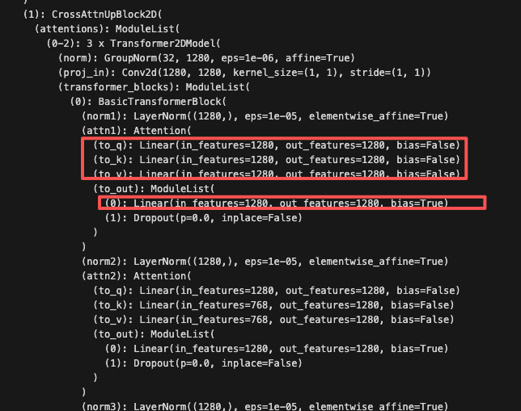
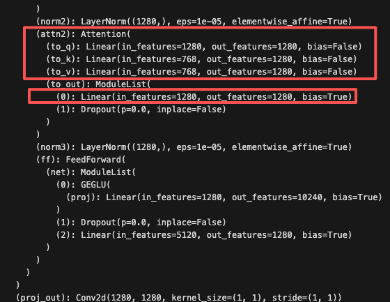
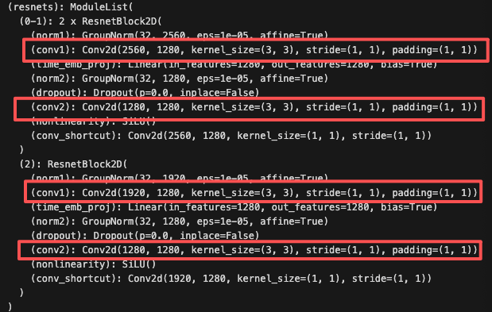

### Question
Model: sd-legacy/stable-diffusion-v1-5
SD'performance is poor on compositional prompt like I mention above.
We adopt LoRA fine-tune on SD with this dataset to see whether we can get optimization(I did small exmperiment and the predictions seem to be better)

### Dataset
Extract from visual-spatial-reasoning
https://drive.google.com/file/d/1IU86c1XrAn26c4cA3u4NlJ2oDTDmPNvk/view?usp=sharing
06284.png	The suitcase contains the cat. \
06285.png	The cat is near the couch. \
06286.png	The cat is touching the handbag. \
06287.png	The teddy bear is on the bench. \
06288.png	The person is touching the hot dog. \
06289.png	The cat is on the microwave. \
The dataset looks like this.

### Evalutaion
T2I-CompBench. Its goal aligns with ours. I haven't firgured out how to use it.

### Task
We adopt LoRA fine-tune on SD with this dataset to see whether we can get optimization(I did small exmperiment and the predictions seem to be better). \
To gain some insight, everyone apply LoRA on different modules to train.

try_LoRA.ipynb
1. Load Model
sd-legacy/stable-diffusion-v1-5
2. Apply LoRA
- down_blocks
    - attn1
    
    - attn2
    
    - resnet
    
- mid_blocks
    - same
- up_blocks
    - same

The following is just my initial idea. The point is we want to see different results if we only LoRA some modules in the entire model.
- owen 
    - all attn1
    - attn1 in down_blocks
    - attn1 in up_blocks
    - attn1 in mid_blocks
- gio 
    - all attn2
    - attn2 in down_blocks
    - attn2in up_blocks
    - attn2 in mid_blocks
- calice 
    - all conv in resnet
    - conv in resnet in down_blocks
    - conv in resnet in up_blocks
    - conv in resnet in mid_blocks
3. Train \
Modify try_LoRA.ipynb to apply LoRA on specific module. Print the model with LoRA to make sure you're doing right. \
I train it on my MacBook air M4 chips. I haven't known the best parameter. We just do some quick experiment for now.

4.  Inference \
Use the prompts as following:\[
   "a chicken on the left of a car",
    "a person on the left of a cow",
    "a horse on the right of a man",
    "a man on side of a cat",
    "a chicken near a book",
    "a bicycle on the right of a girl",
    "a dog next to a phone",
    "a sheep next to a bicycle",
    "a pig on the bottom of a candle",
    "a butterfly on the left of a phone"
] \
Compare the results across everyone's experment and the orignal SD.